### Задача 1
Ссылка на репозиторий с кастомным образом: [custom-nginx](https://hub.docker.com/r/rattus1perfectus/custom-nginx/tags)

### Задача 2
1. Запуск кастомного образа:
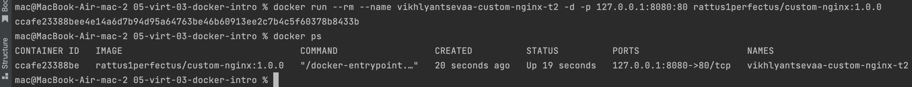
2. Переименование контейнера:
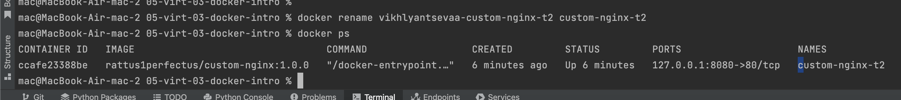
3. Исполнение требуемых команд (с модификацией с учетом того что они выполнены на MacOS):
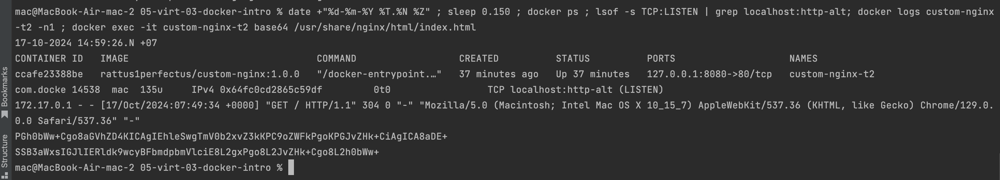
Пояснение что `:8080` - то же самое что `:http-alt`.
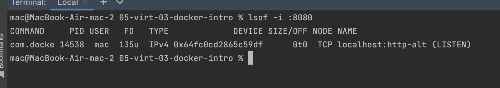
4. Скрин стартовой страницы nginx:
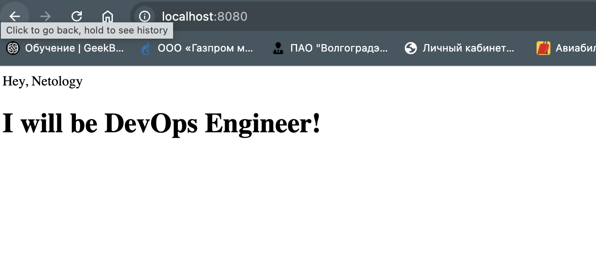

### Задача 3
1. Подключиться к stdin/stdout/stderr можно через:
```shell
docker attach --sig-proxy=false test_redis
```
или 
```shell
docker attach --detach-keys="ctrl-x" test_redis
```
или
```shell
docker attach --no-stdin test_redis
```
--sig-proxy=false - команда `сtrl-c` не передает контейнеру SIGINT и не завершает его работу
--detach-keys - переназначает сочетание клавиш для отсоединения от контейнера
--no-stdin - стандартный вывод игнорируется при подключении (будут видны только выходные данные и сообщения об ошибках).
Подробнее [тут](https://for-each.dev/lessons/b/-ops-docker-attach-detach-container).
2. Подключиться к контейнеру и нажать комбинацию Ctrl-C.
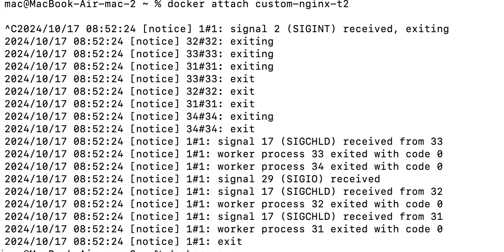
3. При использовании docker attach связываются стандартный ввод, вывод или потоки ошибок с оболочкой хоста.
Команда `сtrl-c` передает контейнеру SIGINT и завершает его работу как если бы он был запущен не в фоновом режиме.
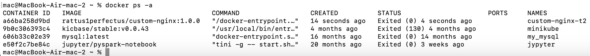
4. Перезапустить контейнер
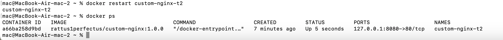
5. Зайти в интерактивный терминал контейнера "custom-nginx-t2" с оболочкой bash.
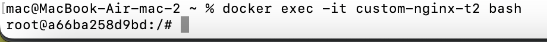
6. Установить любимый текстовый редактор(vim, nano итд) с помощью apt-get.
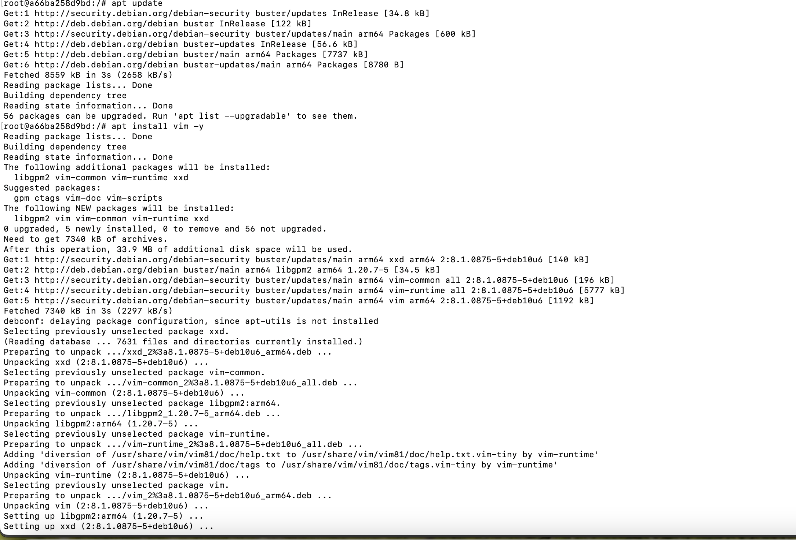
7. Отредактировать файл "/etc/nginx/conf.d/default.conf", заменив порт "listen 80" на "listen 81".
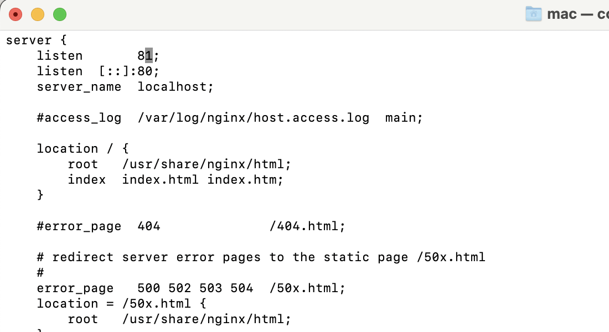
8. Выполнить команду `nginx -s reload`, а затем внутри контейнера `curl http://127.0.0.1:80`; `curl http://127.0.0.1:81`.
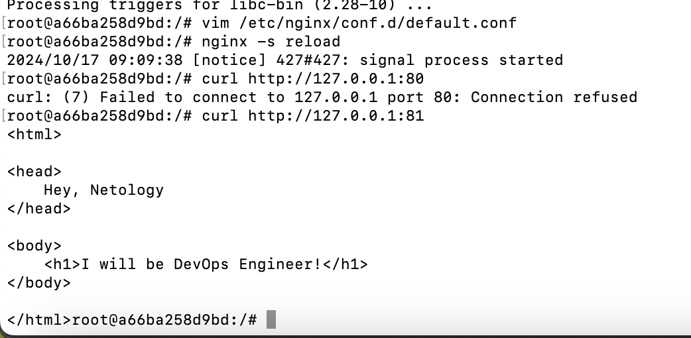
9. Выйти из контейнера, набрав в консоли exit или Ctrl-D.
10. Проверить вывод команд: 
```shell
ss -tlpn | grep 127.0.0.1:8080
``` 
```shell
docker port custom-nginx-t2
```
```shell
curl http://127.0.0.1:8080
```
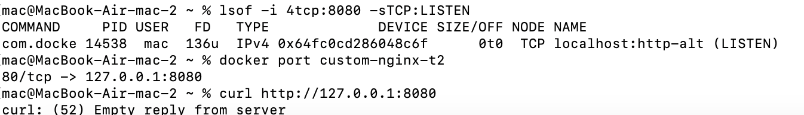
После внесения изменений в конфигурационный файл nginx сервис стал работать на 81 порту. 
В то время как был проброшен 80 порт из контейнера на 8080 хоста. 
Хост слушает порт, на котором больше ничего не работает.
11. Исправить конфигурацию контейнера, используя доступные источники в интернете. 
Не изменять конфигурацию nginx и не удалять контейнер. 
Останавливать контейнер можно. [Пример источника](https://www.baeldung.com/ops/assign-port-docker-container).
>**Не нашел как этого сделать на MacOS....**
>Создал виртуальную машину, отдельную версию образа для платформы linux/amd64, установил там докер и протестировал необходимый кейс.

Остановил контейнер, остановил сервис docker
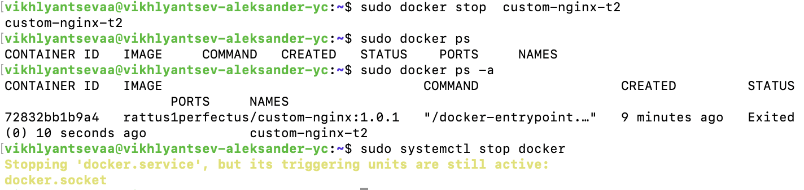
Посмотрел где хранятся метаданные контейнеров
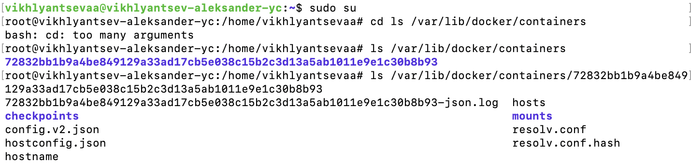
Отредактировал маппинг портов хоста и контейнера в hostconfig.json файле
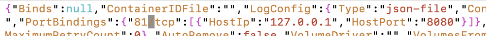
Отредактировал открытые порты (открыл 81) в файле config.v2.json
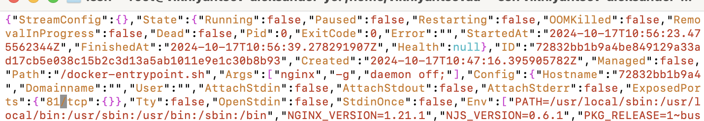
Запустил docker
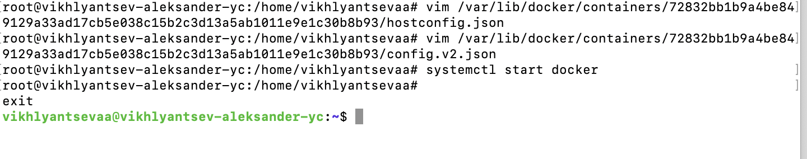
Запустил контейнер и проверил ответ от localhost:8080 (теперь он связан с 81 портом контейнера)
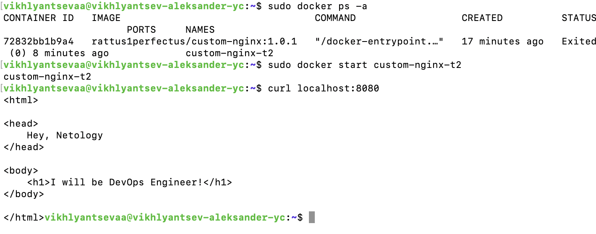
12. Удалите запущенный контейнер "custom-nginx-t2", не останавливая его.(воспользуйтесь --help или google)
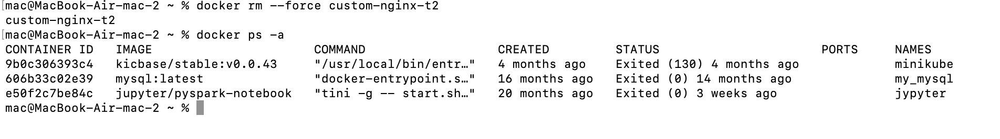

### Задача 4
- Запустить первый контейнер из образа ***centos*** c любым тегом в фоновом режиме, подключив папку  текущий рабочий каталог ```$(pwd)``` на хостовой машине в ```/data``` контейнера, используя ключ -v.
- Запустить второй контейнер из образа ***debian*** в фоновом режиме, подключив текущий рабочий каталог ```$(pwd)``` в ```/data``` контейнера. 
- Подключиться к первому контейнеру с помощью ```docker exec``` и создайте текстовый файл любого содержания в ```/data```.
- Добавить ещё один файл в текущий каталог ```$(pwd)``` на хостовой машине.
- Подключиться во второй контейнер и отобразить листинг и содержание файлов в ```/data``` контейнера.
Результаты представлены на скриншотах ниже:
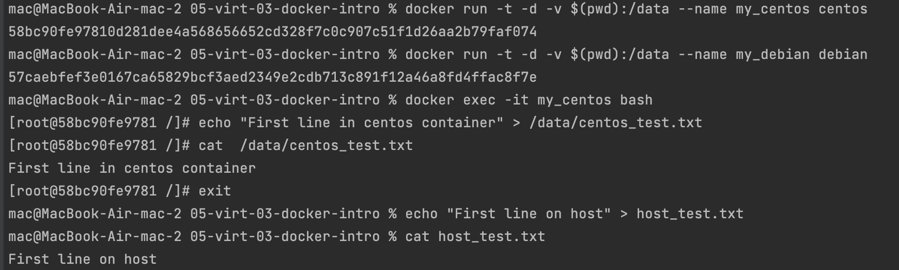
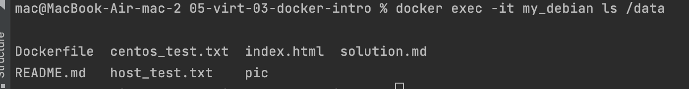

### Задача 5
1. Создал файлы `compose.yaml` и `docker-compose.yaml` и наполнил их содержимым из задания.
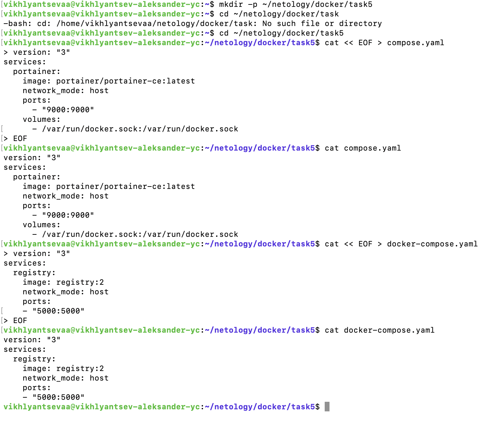
Выполнил команду 
```shell
docker compose up -d
```
Результат ниже на скрине. Запистился `compose.yaml`. Такое название файла является каноничным, а `docker-compose.yaml` оставлено для совместимости с прежними версиями docker-compose. 
При наличии обоих файлов предпочтение отдается первому.  
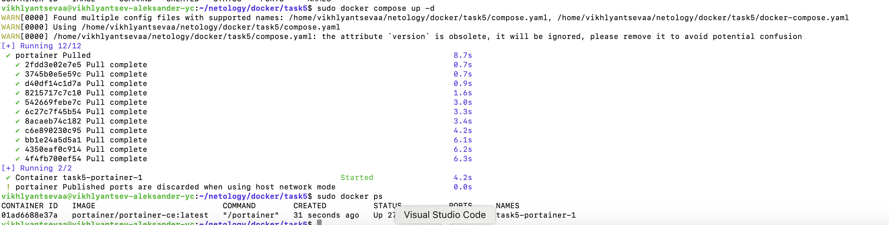
2. Внес изменения в `compose.yaml` файл чтобы оба файла запускалиь. Добавил зависимость, чтобы сервис `registry` запускался после `portainer`.
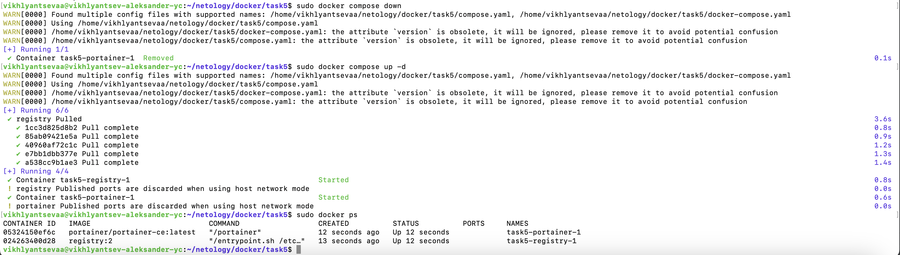
Результат запуска на скрине ниже:
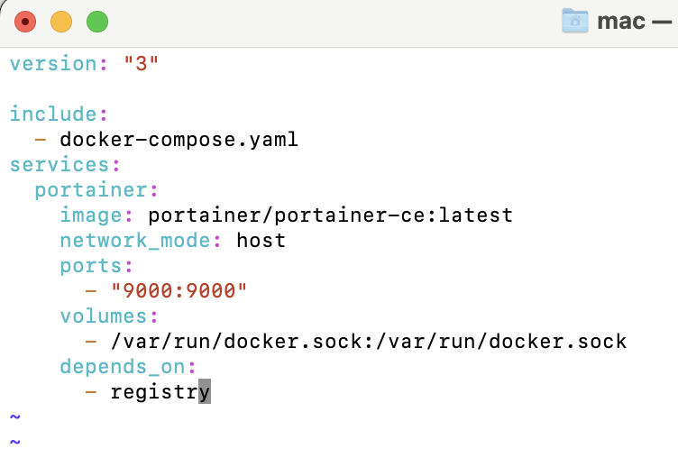
3. Загрузил образ custom-nginx из DockerHub в локально поднятый registry.
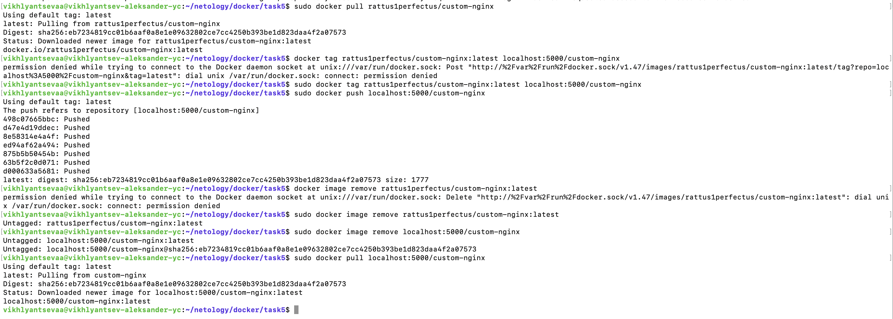
4. Залогинился в portainer
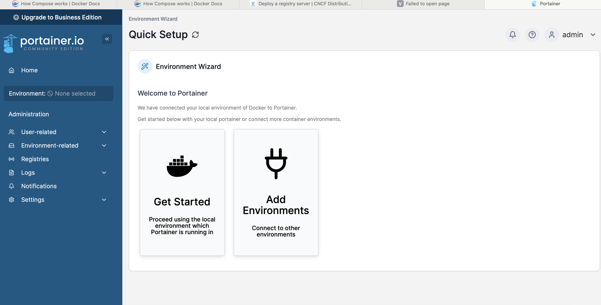
5. Задеплоил компоуз с nginx
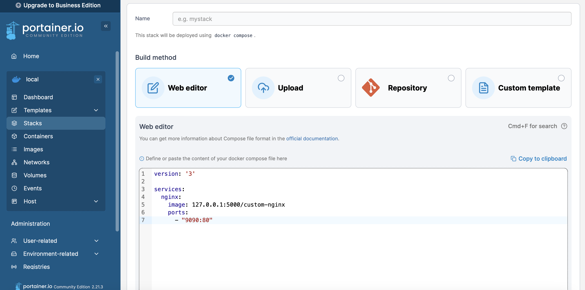
6. Сделал скриншот с информацией о контейнере custom-nginx
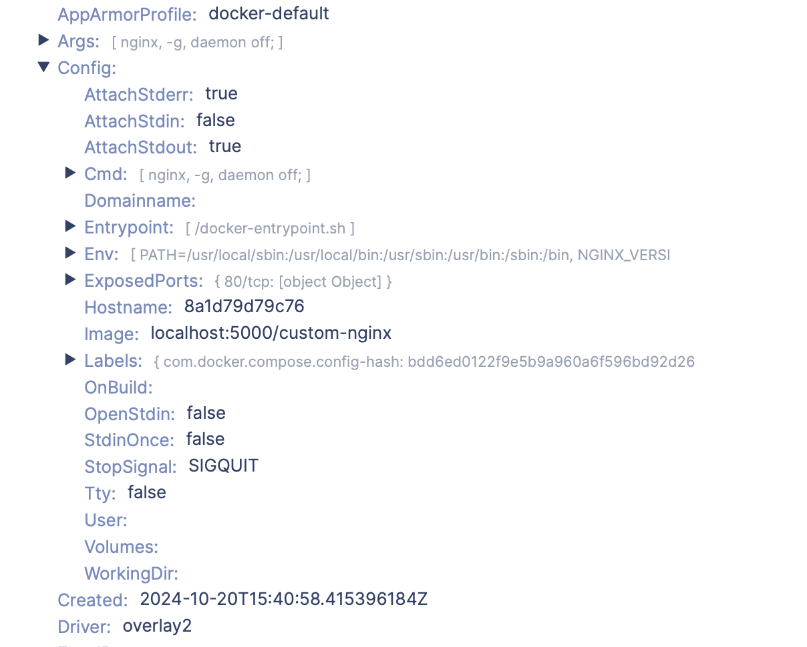
7. Переименовал файл compose.yaml. Запустил
```shell
docker compose up -d
```
Получил предупреждение как на скрине.
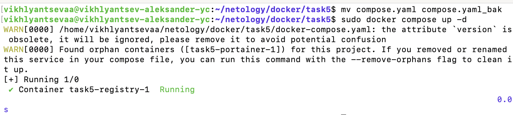
>Для этого проекта найдены потерянные контейнеры ([task5-portainer-1]). 
Если вы удалили или переименовали эту службу в своем файле создания, вы можете запустить эту команду с флагом --remove-orphans, чтобы очистить ее.

При этом сервис portainer все еще работал. Похоже зависимости не удаляются как и контейнеры из переименованных/удаленных манифестов. Просто обновляются контейнеры оставшихся манифестов.
Перевыполнил исполнение манифеста с удалением потерянных контейнеров как и рекомендовалось. portainer выключился.
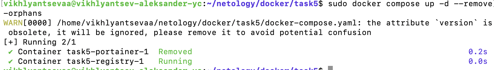
Остановить проект можно командой, приведенной ниже:
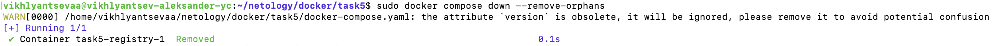
Если нужно остановить все контейнеры, в т.ч. nginx запущенный с помощью portainer, то нужно исполнить следующую команду (она погасит все активные контейнеры):
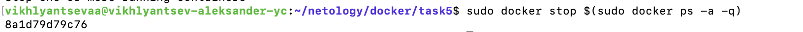


