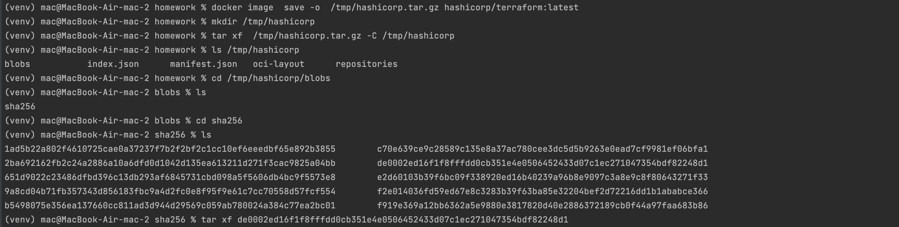

### Задание 0
1. Проверяем что docker-compose не установлен:

<br><br>
2. Устанавливаем docker пакеты, в т.ч. docker compose по [инструкции](https://docs.docker.com/engine/install/ubuntu/#install-using-the-repository).
<br><br>
2.1. Установка официального gpg ключа docker:

<br><br>
2.2. Установка docker и docker compose:

<br><br>
2.3. Проверка версии docker:

<br><br>
2.4. Проверка версии docker compose:


### Задание 1
1. Выполним в своем github пространстве [fork](https://github.com/VikhlyantsevA/shvirtd-example-python) репозитория с домашкой:

<br><br>
2. Создадим файл с именем Dockerfile.python для сборки данного проекта (для 3 задания изучите [документацию](https://docs.docker.com/compose/compose-file/build/))
следуя рекомендациям:
    > - Используйте базовый образ `python:3.9-slim`.<br> 
    > - Обязательно используйте конструкцию `COPY . . в Dockerfile`.<br> 
    > - Не забудьте исключить ненужные в имадже файлы с помощью dockerignore.<br>
    > - Протестируйте корректность сборки.<br>
    
   ```bash
   HOMEWORK_DIR="./05-virt-04-docker-in-practice/homework"
   ```
    Python приложение вместе с зависимостями размещено в репозирории c ДЗ в папке `$HOMEWORK_DIR/app/`. 

    Образ собран из файла `$HOMEWORK_DIR/Dockerfile.python`.
    

    
    Конструкция `COPY . .` не использовалась, т.к. файлов и папок, которые надо исключить через .dockerignore гораздо больше чем те, которые стоит прописать в Dockerfile.python, а также потому что это не рационально с точки зрения сборки образа - main.py и requirements.txt должны быть в разных слоях для ускорения сборки.  
    <br><br>
    Для проверки корректности сборки:
    - создадим сеть в которой будут находиться python приложение и mysql:
    ```bash
    docker network create --subnet=172.20.0.0/16 mynet  
    ```
    - запустим mysql БД (т.к. python приложение сначала создает коннект к БД и если она не будет поднята, приложение упадет и протестировать ничего не получится). 
    ```bash
    docker run --name mysql_db -v ~/db/mysql/conf.d:/etc/mysql/conf.d -v ~/db/mysql/data:/var/lib/mysql \    
   -e MYSQL_ROOT_PASSWORD=$MYSQL_ROOT_PASSWORD -e MYSQL_DATABASE=$MYSQL_DATABASE -e MYSQL_USER=$MYSQL_USER \              
   -e MYSQL_PASSWORD=$MYSQL_PASSWORD -p 127.0.0.1:3306:3306 --network mynet --ip 172.20.0.10 -d mysql
    ```
   - запустим python приложение из образа, передав в переменных окружения креды для коннекта к mysql БД.
   ```bash
   docker run --name ip_reciever -e DB_HOST=$DB_HOST -e DB_USER=$MYSQL_USER -e DB_PASSWORD=$MYSQL_PASSWORD \
   -e DB_NAME=$MYSQL_DATABASE -p 127.0.0.1:5000:5000 --network mynet --ip 172.20.0.5 -d rattus1perfectus/ip_reciever:1.0.0
   ```
   `$MYSQL_ROOT_PASSWORD` - пароль root, создаваемый при запуске mysql;<br> 
   `$MYSQL_DATABASE` - БД, создаваемая при запуске mysql;<br>
   `$MYSQL_USER` - пользователь, создаваемый при запуске mysql;<br>
   `$MYSQL_PASSWORD` - пароль пользователя, создаваемого при запуске mysql;<br> 
   `$DB_HOST` - ip хоста на котором развернут mysql (172.20.0.10 в нашем случае).<br>
   Для проверки эти значения были записаны на хосте в виде переменных окружения.
   
   <br><br>
   Проверяем подключение к БД `virtd`:
   
   <br><br>
   Проверяем таблицу requests (была создана при запуске python приложения):
   
   <br><br>
   Делаем обращение к нашему python приложению по порту 5000 на хосте и проверяем содержимое таблицы requests еще раз:
   
   <br><br>
   Повторная проверка таблицы requests в контейнере с mysql через его cli:
   
   
   Повторная проверка таблицы requests на хосте через dbeaver:
   

### Задание 2(*)
1. Создайте в yandex cloud container registry с именем "test" с помощью "yc tool" . [Инструкция](https://yandex.cloud/ru/docs/container-registry/quickstart/?from=int-console-help&utm_referrer=about%3Ablank)
2. Настройте аутентификацию вашего локального docker в yandex container registry.
3. Соберите и залейте в него образ с python приложением из задания №1.
4. Просканируйте образ на уязвимости.
5. В качестве ответа приложите отчет сканирования.
<br><br>

<br><br>


### Задание 3
1. Изучите файл "proxy.yaml"
2. Создайте в репозитории с проектом файл ```compose.yaml```. С помощью директивы "include" подключите к нему файл "proxy.yaml".
3. Опишите в файле ```compose.yaml``` следующие сервисы:
   - ```web```<br> 
   Образ приложения должен ИЛИ собираться при запуске compose из файла ```Dockerfile.python``` ИЛИ скачиваться из yandex cloud container registry(из задание №2 со *).<br> 
   Контейнер должен работать в bridge-сети с названием ```backend``` и иметь фиксированный ipv4-адрес ```172.20.0.5```.<br>
   Сервис должен всегда перезапускаться в случае ошибок.
   Передайте необходимые ENV-переменные для подключения к Mysql базе данных по сетевому имени сервиса ```web```.
   - ```db```<br> 
   image=mysql:8.<br>
   Контейнер должен работать в bridge-сети с названием ```backend``` и иметь фиксированный ipv4-адрес ```172.20.0.10```.<br> 
   Явно перезапуск сервиса в случае ошибок.<br>
   Передайте необходимые ENV-переменные для создания: пароля root пользователя, создания базы данных, пользователя и пароля для web-приложения.<br>
   Обязательно используйте уже существующий .env file для назначения секретных ENV-переменных!
4. Запустите проект локально с помощью docker compose , добейтесь его стабильной работы: команда ```curl -L http://127.0.0.1:8090``` должна возвращать в качестве ответа время и локальный IP-адрес.<br>
Если сервисы не стартуют воспользуйтесь командами: ```docker ps -a ``` и ```docker logs <container_name>```.<br>
Если вместо IP-адреса вы получаете ```NULL``` --убедитесь, что вы шлете запрос на порт ```8090```, а не 5000.
<br><br>
Запуск проекта. Состояние контейнеров проекта:

<br><br>
Результат curl запроса:

`PS: Так и не удалось этот момент победить. Как я понял докер хост запущен на виртуальной машине и достучаться до него с моего mac на котором запущен Docker Desktop невозможно. В моем случае приходилось запускать оболочку bash в контейнере с ingress и из него делать curl на 127.0.0.1:8090. ip был соответственно 127.0.0.1. Возможно предполагалось что задание будет запускаться на Linux машине и там все будет нормально, но у меня MacOS c M1 - virtualBox не работает, а Qemu очень перегружает комп. Дальше в Задании 4 я запускал проект на ВМ Linux в Yandex Cloud и там обращение по 127.0.0.1:8090 нормально обрабатывалось и не надо было в контейнер ingress заходить. Похоже возникшая проблема - особенность работы Docker на MacOS.`
5. Подключитесь к БД mysql с помощью команды ```docker exec <имя_контейнера> mysql -uroot -p<пароль root-пользователя>```(обратите внимание что между ключем -u и логином root нет пробела. это важно!!! тоже самое с паролем).<br>
Введите последовательно команды (не забываем в конце символ ; ): ```SHOW DATABASES; USE virtd; SHOW TABLES; SELECT * FROM requests LIMIT 10;```.
<br><br>
Подключение к БД:

<br><br>
Проверка БД и таблицы:

6. Остановите проект.
<br><br>
Остановка проекта:


## Задание 4
1. Запустите в Yandex Cloud ВМ (вам хватит 2 Гб Ram).
2. Подключитесь к ВМ по ssh и установите docker.
Docker уже установлен в Задании 0 вместе c docker compose:

3. Напишите bash-скрипт, который скачает ваш fork-репозиторий в каталог /opt и запустит проект целиком.
Bash-скрипт лежит в папке `$HOMEWORK_DIR/clone_project.sh` вместе с остальным ДЗ. 
<br><br>
Написание скрипта:

<br><br>
Создание ssh ключа для клонирования репозитория:

<br><br>
Результат запуска скрипта:

<br><br>

<br><br>
Проверим что сервисы подняты:

<br><br>
Проверим что ответ от сервиса web приходит на ВМ через лупбэк:

<br><br>
Проверим доступность сервиса с хоста (с ПК). Для этого добавим маппинг dns имени ВМ и ip в `/etc/hosts`. После сделаем curl запрос по доменному имени:

4. Зайдите на сайт проверки http подключений, например(или аналогичный): ```https://check-host.net/check-http``` и запустите проверку вашего сервиса ```http://<внешний_IP-адрес_вашей_ВМ>:8090```. Таким образом трафик будет направлен в ingress-proxy. ПРИМЕЧАНИЕ:  приложение(old_main.py) весьма вероятно упадет под нагрузкой, но успеет обработать часть запросов - этого достаточно. Обновленная версия (main.py) не прошла достаточного тестирования временем, но должна справиться с нагрузкой.
5. (Необязательная часть) Дополнительно настройте remote ssh context к вашему серверу. Отобразите список контекстов и результат удаленного выполнения ```docker ps -a```
<br><br>
Пропустил это задание.
7. В качестве ответа повторите  sql-запрос и приложите скриншот с данного сервера, bash-скрипт и ссылку на fork-репозиторий.
Ссылка на fork репозитория в который залит проект [тут](https://github.com/VikhlyantsevA/shvirtd-example-python/tree/dev).
<br><br>
Подключение к БД

<br><br>
Результат sql запроса:


### Задача 5 (*)
1. Напишите и задеплойте на вашу облачную ВМ bash скрипт, который произведет резервное копирование БД mysql в директорию "/opt/backup" с помощью запуска в сети "backend" контейнера из образа schnitzler/mysqldump при помощи docker run ... команды. Подсказка: "документация образа."
<br><br>
В доке по образу schnitzler/mysqldump нашел ниже указанную команду для разового дампа БД. Указал сеть в которой находится контейнер с БД.
```shell
sudo docker run \
    --rm --entrypoint "" \
    -v `pwd`/backup:/backup \
    --link="shvirtd-example-python-db-1:db" \
    --net shvirtd-example-python_backend \
    schnitzler/mysqldump \
    mysqldump --opt -h db -u app -p"пароль из .env" "--result-file=/backup/dumps.sql" virtd
```
При запуске получаю ошибку:
`mysqldump: Got error: 1045: "Plugin caching_sha2_password could not be loaded: Error loading shared library /usr/lib/mariadb/plugin/caching_sha2_password.so: No such file or directory" when trying to connect`
<br><br>
Рабочим вариантом оказалось использовать mysqldump из контейнера, в котором запущена БД согласно доке образа [mysql](https://hub.docker.com/_/mysql)
```shell
sudo docker exec shvirtd-example-python-db-1 sh -c 'exec mysqldump -uroot -p"$MYSQL_ROOT_PASSWORD" virtd' > "opt/backup/virtd_$(date '+%Y-%m-%d_%H:%M:%S').sql"
```
Скрипт в репозитории в `$HOMEWORK_DIR/make_dump.sh`.
<br><br>
2. Протестируйте ручной запуск
<br><br>
Результат ручного запуска

3. Настройте выполнение скрипта раз в 1 минуту через cron, crontab или systemctl timer. Придумайте способ не светить логин/пароль в git!! (не понял при чем тут git? Если речь о скачивании репозитория с проектом, то я сделал по ssh - Задание 4, п.3)
<br><br>
Cоздание джобы в crontab 1:


4. Предоставьте скрипт, cron-task и скриншот с несколькими резервными копиями в "/opt/backup"
<br><br>


## Задача 6
1. Скачайте docker образ ```hashicorp/terraform:latest``` и скопируйте бинарный файл ```/bin/terraform``` на свою локальную машину, используя dive и docker save.
Предоставьте скриншоты  действий.
<br><br>
Скачивание образа terraform:

<br><br>
Запуск dive в docker контейнере для исследования образа terraform:

<br><br>
Поиск слоя в котором добавлялся файл /bin/terraform:

<br><br>
Хэш искомого слоя: 
sha256:de0002ed16f1f8fffdd0cb351e4e0506452433d07c1ec271047354bdf82248d1
<br><br>
Сохранение и распаковка образа

<br><br>
Распаковка слоя c файлом /bin/terraform.


## Задача 6.1
1. Добейтесь аналогичного результата, используя docker cp.
Предоставьте скриншоты  действий.
<br><br>
Запуск контейнера terraform и копирование /bin/terraform в папку /tmp/hashicorp на локальном ПК:

