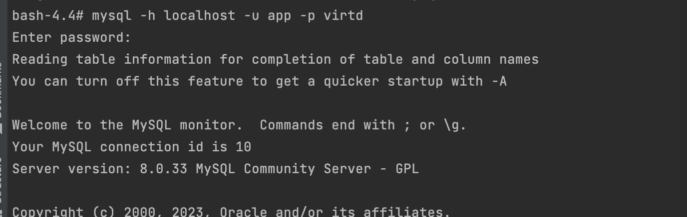

### Задание 0
1. Проверяем что docker-compose не установлен:

<br><br>
2. Устанавливаем docker пакеты, в т.ч. docker compose по [инструкции](https://docs.docker.com/engine/install/ubuntu/#install-using-the-repository).
<br>
2.1. Установка официального gpg ключа docker:

<br>
2.2. Установка docker и docker compose:

<br>
2.3. Проверка версии docker:

<br>
2.4. Проверка версии docker compose:


### Задание 1
1. Выполним в своем github пространстве [fork](https://github.com/VikhlyantsevA/shvirtd-example-python) репозитория с домашкой:

<br><br>
2. Создадим файл с именем Dockerfile.python для сборки данного проекта (для 3 задания изучите [документацию](https://docs.docker.com/compose/compose-file/build/))
следуя рекомендациям:
    > - Используйте базовый образ `python:3.9-slim`.<br> 
    > - Обязательно используйте конструкцию `COPY . . в Dockerfile`.<br> 
    > - Не забудьте исключить ненужные в имадже файлы с помощью dockerignore.<br>
    > - Протестируйте корректность сборки.<br>
    
   ```bash
   HOMEWORK_DIR="./05-virt-04-docker-in-practice/homework"
   ```
    Python приложение вместе с зависимостями размещено в репозирории c ДЗ в папке `$HOMEWORK_DIR/app/`. 

    Образ собран из файла `$HOMEWORK_DIR/Dockerfile.python`.
    

    
    Конструкция `COPY . .` не использовалась, т.к. файлов и папок, которые надо исключить через .dockerignore гораздо больше чем те, которые стоит прописать в Dockerfile.python, а также потому что это не рационально с точки зрения сборки образа - main.py и requirements.txt должны быть в разных слоях для ускорения сборки.  
    <br><br>
    Для проверки корректности сборки:
    - создадим сеть в которой будут находиться python приложение и mysql:
    ```bash
    docker network create --subnet=172.20.0.0/16 mynet  
    ```
    - запустим mysql БД (т.к. python приложение сначала создает коннект к БД и если она не будет поднята, приложение упадет и протестировать ничего не получится). 
    ```bash
    docker run --name mysql_db -v ~/db/mysql/conf.d:/etc/mysql/conf.d -v ~/db/mysql/data:/var/lib/mysql \    
   -e MYSQL_ROOT_PASSWORD=$MYSQL_ROOT_PASSWORD -e MYSQL_DATABASE=$MYSQL_DATABASE -e MYSQL_USER=$MYSQL_USER \              
   -e MYSQL_PASSWORD=$MYSQL_PASSWORD -p 127.0.0.1:3306:3306 --network mynet --ip 172.20.0.10 -d mysql
    ```
   - запустим python приложение из образа, передав в переменных окружения креды для коннекта к mysql БД.
   ```bash
   docker run --name ip_reciever -e DB_HOST=$DB_HOST -e DB_USER=$MYSQL_USER -e DB_PASSWORD=$MYSQL_PASSWORD \
   -e DB_NAME=$MYSQL_DATABASE -p 127.0.0.1:5000:5000 --network mynet --ip 172.20.0.5 -d rattus1perfectus/ip_reciever:1.0.0
   ```
   $MYSQL_ROOT_PASSWORD - пароль root, создаваемый при запуске mysql;<br> 
   $MYSQL_DATABASE - БД, создаваемая при запуске mysql;<br>
   $MYSQL_USER - пользователь, создаваемый при запуске mysql;<br>
   $MYSQL_PASSWORD - пароль пользователя, создаваемого при запуске mysql;<br> 
   $DB_HOST - ip хоста на котором развернут mysql (172.20.0.10 в нашем случае).<br>
   Для проверки эти значения были записаны на хосте в виде переменных окружения.
   
   <br><br>
   Проверяем подключение к БД `virtd`, которая была создана при запуске mysql вместе с пользователем `app`:
   
   <br><br>
   Проверяем таблицу requests (была создана при запуске python приложения):
   
   <br><br>
   Делаем обращение к нашему python приложению по порту 5000 на хосте и проверяем содержимое таблицы requests еще раз:
   
   <br><br>
   Повторная проверка таблицы requests в контейнере с mysql через его cli:
   
   
   Повторная проверка таблицы requests на хосте через dbeaver:
   

### Задание 2(*)
1. Создайте в yandex cloud container registry с именем "test" с помощью "yc tool" . [Инструкция](https://yandex.cloud/ru/docs/container-registry/quickstart/?from=int-console-help&utm_referrer=about%3Ablank)
2. Настройте аутентификацию вашего локального docker в yandex container registry.
3. Соберите и залейте в него образ с python приложением из задания №1.
4. Просканируйте образ на уязвимости.
5. В качестве ответа приложите отчет сканирования.
<br>

<br>


### Задание 3
1. Изучите файл "proxy.yaml"
2. Создайте в репозитории с проектом файл ```compose.yaml```. С помощью директивы "include" подключите к нему файл "proxy.yaml".
3. Опишите в файле ```compose.yaml``` следующие сервисы:
   - ```web```<br> 
   Образ приложения должен ИЛИ собираться при запуске compose из файла ```Dockerfile.python``` ИЛИ скачиваться из yandex cloud container registry(из задание №2 со *).<br> 
   Контейнер должен работать в bridge-сети с названием ```backend``` и иметь фиксированный ipv4-адрес ```172.20.0.5```.<br>
   Сервис должен всегда перезапускаться в случае ошибок.
   Передайте необходимые ENV-переменные для подключения к Mysql базе данных по сетевому имени сервиса ```web```.
   - ```db```<br> 
   image=mysql:8.<br>
   Контейнер должен работать в bridge-сети с названием ```backend``` и иметь фиксированный ipv4-адрес ```172.20.0.10```.<br> 
   Явно перезапуск сервиса в случае ошибок.<br>
   Передайте необходимые ENV-переменные для создания: пароля root пользователя, создания базы данных, пользователя и пароля для web-приложения.<br>
   Обязательно используйте уже существующий .env file для назначения секретных ENV-переменных!
4. Запустите проект локально с помощью docker compose , добейтесь его стабильной работы: команда ```curl -L http://127.0.0.1:8090``` должна возвращать в качестве ответа время и локальный IP-адрес.<br>
Если сервисы не стартуют воспользуйтесь командами: ```docker ps -a ``` и ```docker logs <container_name>```.<br>
Если вместо IP-адреса вы получаете ```NULL``` --убедитесь, что вы шлете запрос на порт ```8090```, а не 5000.
Запуск проекта:

Состояние контейнеров проекта:
<br>

<br>
Результат запроса:

5. Подключитесь к БД mysql с помощью команды ```docker exec <имя_контейнера> mysql -uroot -p<пароль root-пользователя>```(обратите внимание что между ключем -u и логином root нет пробела. это важно!!! тоже самое с паролем).<br>
Введите последовательно команды (не забываем в конце символ ; ): ```SHOW DATABASES; USE virtd; SHOW TABLES; SELECT * FROM requests LIMIT 10;```.
<br>
Подключение к БД:

<br>
Проверка БД и таблицы:

6. Остановите проект.
Остановка проекта:
